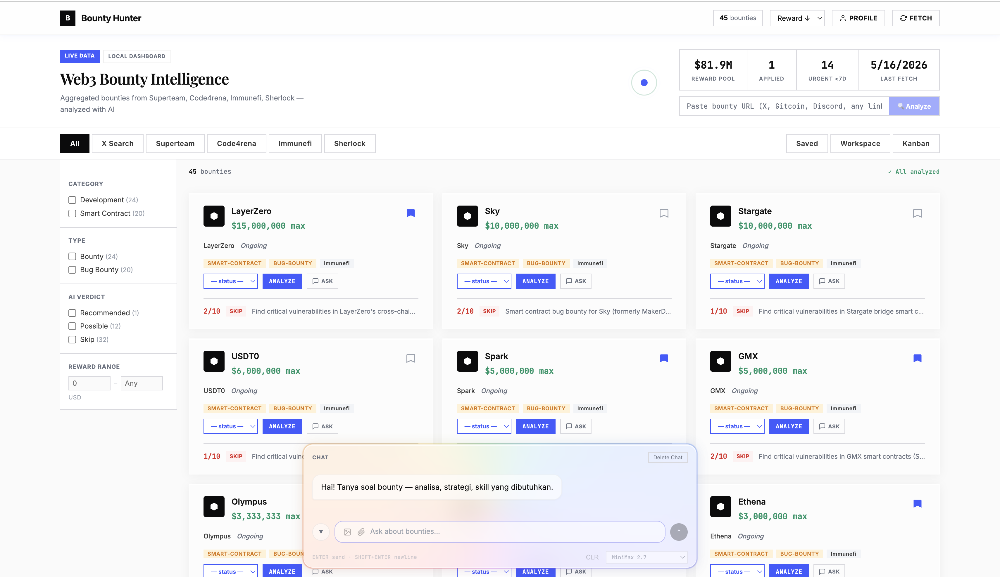
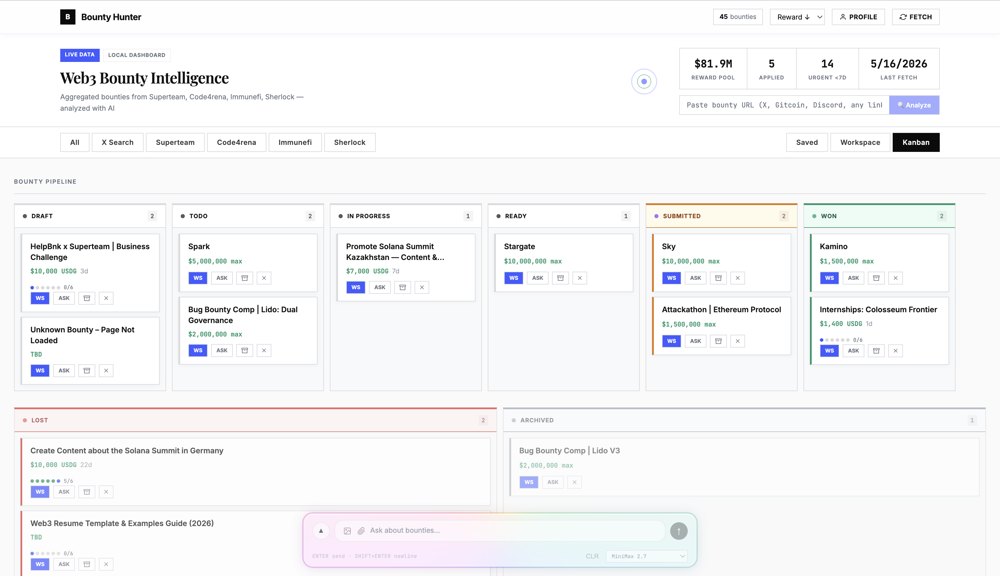
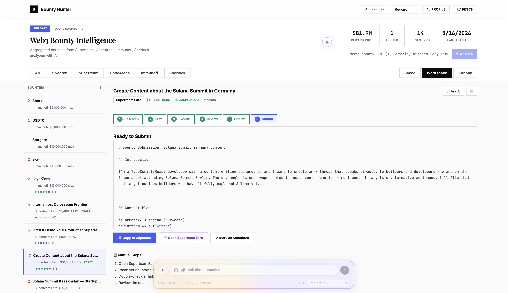
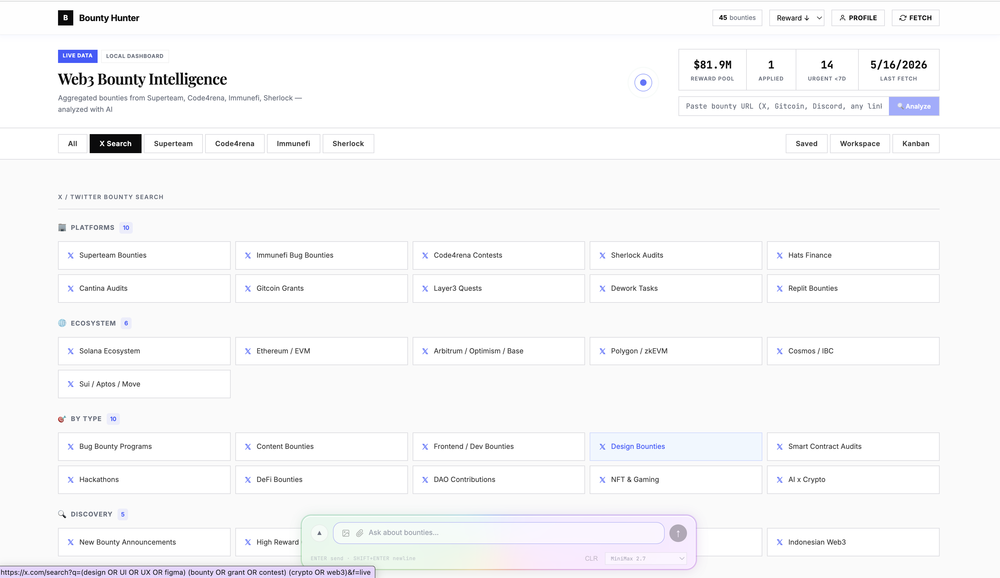

# Bounty Hunter

AI-driven local dashboard for Web3 bounty hunting, powered by [Hermes Agent](https://github.com/nousresearch/hermes-agent). Analyze, strategize, and execute bounties with an AI co-pilot that assists at every step — from discovery to submission.

## Screenshots


*Main dashboard — bounty grid with AI analysis scores, filters, and universal URL intake*


*Kanban board — drag-drop status tracking with automatic transitions*


*AI Workspace — step-by-step bounty execution powered by Hermes Agent*


*X Search — 31 curated queries to discover bounties on Twitter/X*

## What is this?

Bounty Hunter is a personal command center for Web3 bounty hunters, built on top of **Hermes Agent** as its AI backbone. Instead of juggling browser tabs, spreadsheets, and chat windows, you get a single dashboard that:

- **Aggregates bounties** from multiple platforms (Superteam Earn, Code4rena, Immunefi, Sherlock)
- **AI-analyzes each bounty** against your skill profile — scoring difficulty, match, and strategy
- **Guides you through execution** with a step-by-step workspace powered by Hermes co-pilot
- **Tracks progress** via Kanban board with automatic status transitions

## Powered by Hermes Agent

[Hermes Agent](https://github.com/nousresearch/hermes-agent) is the brain behind every AI interaction in this dashboard. It's not just another chatbot wrapper — Hermes is a full autonomous agent framework that provides:

- **Isolated sessions per bounty** — each bounty gets its own Hermes session with dedicated context, so the AI remembers everything about that specific bounty across interactions
- **Tool-augmented reasoning** — Hermes can browse the web, read documents, execute code, and use any MCP tool to research bounties deeply
- **Multi-model orchestration** — route different tasks to different models (fast model for quick analysis, strong model for complex strategy)
- **Persistent memory** — learnings from past bounties inform future recommendations
- **Co-pilot mode** — AI assists and suggests, you stay in control and make decisions

### Why Hermes Agent?

Traditional bounty hunting tools are either pure trackers (no AI) or simple chatbots (no context). Hermes Agent bridges the gap:

| Traditional Tools | Chatbot Wrappers | Hermes-Powered |
|---|---|---|
| Manual tracking | Stateless conversations | Persistent per-bounty sessions |
| No AI assistance | Generic responses | Context-aware strategy |
| Tab juggling | Copy-paste context | Auto-scrapes & analyzes |
| No workflow | Single-turn Q&A | Multi-step guided execution |

The co-pilot doesn't just generate text — it acts as a research partner that can scrape bounty pages, analyze smart contracts, cross-reference documentation, and produce actionable execution plans.

## AI Co-Pilot Workspace

Every bounty gets a dedicated workspace with Hermes-powered steps:

| Step | What Hermes Does |
|------|-----------------|
| **Research** | Scrapes bounty page, structures requirements, identifies deliverables |
| **Generate** | Produces execution checklist based on research + your skill profile |
| **Execute** | Interactive checklist + contextual chat — ask questions, get guidance |
| **Finalize** | Review, polish, prepare submission |

Each step auto-transitions the Kanban status, so your board always reflects actual progress.

## Features

- **Universal Bounty Intake** — paste any URL (Gitcoin, Discord, blog post, X thread) → Hermes extracts and analyzes
- **Smart Kanban** — auto-moves cards as you progress through workspace steps
- **X Search** — 31 curated search queries across 4 categories to discover bounties on X/Twitter
- **Multi-model chat** — pick the right model for each task (Claude, GPT, DeepSeek, Kimi, MiniMax)
- **Profile-aware scoring** — AI knows your skills and recommends bounties accordingly
- **Fully local** — your data stays on your machine, no cloud dependency

## Stack

| Layer | Tech |
|-------|------|
| Frontend | React 19 + TypeScript + Vite + Zustand |
| UI | Custom CSS, @dnd-kit for Kanban drag-drop |
| Backend | Python `serve.py` (stdlib http.server) |
| Database | SQLite (WAL mode) |
| AI Engine | **Hermes Agent** — multi-model via configurable OpenAI-compatible endpoints |

## Quick Start

### Prerequisites

- Python 3.9+
- Node.js 20+
- [Hermes Agent](https://github.com/nousresearch/hermes-agent) installed and running
- An OpenAI-compatible LLM endpoint (local or remote)

### Setup

```bash
git clone https://github.com/adryndian/hermes-bug-and-bounty-hunter-web3.git
cd hermes-bug-and-bounty-hunter-web3

# Configure your AI endpoints
cp .env.example .env
# Edit .env — point to your Hermes Agent instance

# Install frontend
cd app && npm install --include=dev && cd ..

# Start (both backend + frontend)
./start.sh
# Or manually:
# Terminal 1: python3 serve.py
# Terminal 2: cd app && npm run dev
```

Open `http://localhost:5173`

### Environment Variables

```env
LLM_API_URL=http://127.0.0.1:8642      # Hermes Agent gateway
LLM_API_KEY=your-hermes-key             # Hermes API key
LLM_ROUTER_URL=http://127.0.0.1:20128   # Secondary router (9Router, optional)
LLM_ROUTER_KEY=your-router-key          # Router API key
LLM_DEFAULT_MODEL=your-model-name       # Default model for analysis
API_SERVER_KEY=your-hermes-key           # Hermes Agent API key (for co-pilot sessions)
```

## Architecture

```
┌─────────────────────────────────────────────────────────────────┐
│  Browser (localhost:5173)                                        │
│  React 19 + Zustand + Vite                                      │
│                                                                  │
│  ┌──────────┐ ┌──────────┐ ┌───────────┐ ┌────────┐ ┌────────┐│
│  │ BountyGrid│ │  Kanban  │ │ Workspace │ │X Search│ │  Chat  ││
│  └──────────┘ └──────────┘ └───────────┘ └────────┘ └────────┘│
└──────────────────────┬──────────────────────────────────────────┘
                       │ fetch /api/*, /db/*
                       ▼
┌─────────────────────────────────────────────────────────────────┐
│  serve.py (localhost:3333)                                       │
│                                                                  │
│  ┌─────────────────┐  ┌──────────────────┐  ┌────────────────┐ │
│  │ Bounty Endpoints│  │ Co-pilot Pipeline│  │ Model Router   │ │
│  │ - /api/bounties │  │ - /api/copilot/* │  │ hermes:* → GW  │ │
│  │ - /api/analyze  │  │ - /draft-research│  │ cx/* → GW      │ │
│  │ - /db/statuses  │  │ - /draft-generate│  │ kr/* → 9Router │ │
│  │ - /db/analysis  │  │ - /generate-check│  │ fw/* → 9Router │ │
│  └─────────────────┘  └──────────────────┘  └────────────────┘ │
│                                                                  │
│  ┌─────────────────┐  ┌──────────────────┐                     │
│  │ URL Scraper     │  │ Analyze Engine   │                     │
│  │ Jina → BS4      │  │ AI scoring +     │                     │
│  │ fallback chain  │  │ verdict engine   │                     │
│  └─────────────────┘  └──────────────────┘                     │
└────────┬────────────────────┬───────────────────────────────────┘
         │                    │
         ▼                    ▼
┌─────────────────┐  ┌────────────────────────────────────────────┐
│  SQLite DB      │  │  Hermes Agent                              │
│  (WAL mode)     │  │                                            │
│                 │  │  ┌──────────────┐  ┌─────────────────────┐ │
│  - bounties     │  │  │ Gateway:8642 │  │ 9Router:20128       │ │
│  - analysis     │  │  │ (Hermes LLM) │  │ (Claude, GPT,       │ │
│  - statuses     │  │  └──────────────┘  │  DeepSeek, Kimi,    │ │
│  - history      │  │                    │  MiniMax, Fireworks) │ │
│  - sessions     │  │  ┌──────────────┐  └─────────────────────┘ │
│  - learnings    │  │  │ Per-bounty   │                          │
│                 │  │  │ sessions w/  │                          │
│                 │  │  │ isolated ctx │                          │
│                 │  │  └──────────────┘                          │
└─────────────────┘  └────────────────────────────────────────────┘
```

## Workflow

```
┌─────────────────────────────────────────────────────────────┐
│                    BOUNTY LIFECYCLE                          │
├─────────────────────────────────────────────────────────────┤
│                                                             │
│  ① DISCOVER                                                 │
│  ├─ Browse aggregated bounties (Grid tab)                   │
│  ├─ Search X/Twitter (X Search tab)                         │
│  └─ Paste any URL → AI auto-analyze (Hero input)           │
│                                                             │
│  ② ANALYZE (Hermes Agent)                                   │
│  ├─ Scrape bounty page (Jina → BS4)                        │
│  ├─ AI scores: match_score, difficulty, time_estimate       │
│  ├─ AI verdict: recommended / possible / skip              │
│  └─ Auto-creates Kanban card → Draft column                │
│                                                             │
│  ③ WORKSPACE (Hermes Co-pilot)                              │
│  ├─ Research: deep-dive requirements + deliverables         │
│  │   └─ Kanban auto-move → Todo                            │
│  ├─ Generate: execution checklist from research            │
│  │   └─ Kanban auto-move → In Progress                     │
│  ├─ Execute: work through checklist + chat with Hermes     │
│  └─ Finalize: review + polish submission                   │
│      └─ Kanban auto-move → Ready                           │
│                                                             │
│  ④ SUBMIT                                                   │
│  ├─ Copy final submission                                   │
│  ├─ Mark as Submitted on platform                          │
│  └─ Kanban → Submitted → Won / Lost                        │
│                                                             │
│  ⑤ LEARN                                                    │
│  ├─ Record outcome (won/lost/skipped)                      │
│  ├─ Save lessons learned                                    │
│  └─ Hermes uses learnings for future recommendations       │
│                                                             │
└─────────────────────────────────────────────────────────────┘
```

## Kanban Flow

```
Draft → Todo → In Progress → Ready → Submitted → Won
                                                  └→ Lost
                                                  └→ Archived
```

Status transitions happen automatically as you progress through Hermes workspace steps, or manually via drag-and-drop.

## License

MIT
